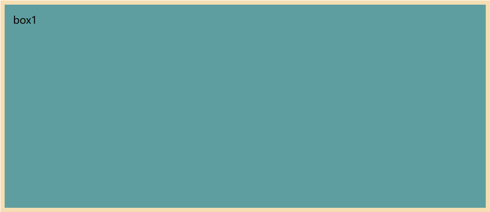
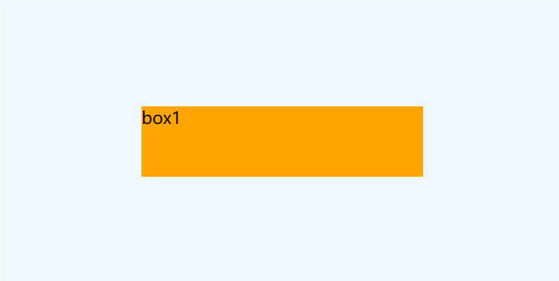

### 自己的学习内容

<text style="color:tomato">css3</text> --2023.05.09 完结  
<text style="color:tomato">html5</text> --2023.04.24 完结  
<text style="color:tomato">html、css</text> --2023.04.21 完结  
<text style="color:tomato">html、html5、css、css3</text> --2023.03.23  开始

#### 元素标签

1.标签不必在意显示效果,注重标签含义  
2.块级元素独占一行,可内嵌块级元素、行内元素,&lt;p&gt;、&lt;h1&gt;~&lt;h6&gt;、&lt;dt&gt;之间不相互嵌套  
3.行内元素占显示内容的大小,可内嵌行内元素

#### 文本常用标签

<em>1.em</em> 强调  
<strong>2.strong</strong> 强调   
3.span 无预设显示效果  
<cite>4.作品</cite>  
<dfn>5.同上</dfn>     
<del>6.中间划线</del>/<ins>底部划线</ins>  
<code>7.alert(1)</code>  
<samp>8.识别内容</samp>  
<kbd>9.键盘</kbd>  
<abbr title="abcde">10.缩写</abbr>  
<bdo dir="ltr">11.你是爱心的欢喜( ltr / rtl )</bdo>  
<code>12.变量 let <var>a</var> = 1</code>  
<small>13.法律细则</small>  
<b>14.产品评论</b>  
<i>15.用于字体图标、人物说的话</i>  
<u>16.用于标错</u>  
<q>17.引用</q>  

<blockquote>18.块引用,独占一块</blockquote>  
<address>19.地址,独占一块</address>

#### 绝对路径补充

本地绝对路径  
网络绝对路径

#### 图片格式介绍

<kbd><var>jpg jpeg</var> 损失细节存储,不支持动态图、透明背景</kbd>  
<kbd><var>png</var> 无损压缩,不支持动态图</kbd>  
<kbd><var>bmp</var> 不进行压缩,保存更多细节,不支持动态图、透明背景 == png+</kbd>  
<kbd><var>gif</var> 显示动态图,显示颜色有限</kbd>  
<kbd><var>webp</var> 显示网页图片,支持动态图,兼容性不足</kbd>  
<kbd><var>base64</var> 显示网页图片,图片本身以编码形式显示</kbd> 

#### 超链接

<blockquote>

<em>——属性值</em>
  

target
  
    _self: 在本标签进行跳转 
    _blank: 在新标签进行跳转

download

填写下载名或不填

<em>——浏览器支持的文件</em>

<code>jpg gif mp4 pdf</code> 
<code>zip 不可以直接打开</code>

<em>——锚点</em>

<code>跳转:href="#(锚点名字)"</code> 
<code>回到顶部:href="#"</code> 
<code>刷新页面:href=""</code> 
<code>命名_1:name="(锚点名字)"</code> 
<code>命名_2:id="(锚点名字)"<strong> 推荐</strong></code> 

<em>——唤醒应用</em>

<code>打电话:href="tel:电话号码"</code> 
<code>发邮件:href="mailto:邮件名"</code> 
<code>发短信:href="sms:收件人"</code> 
</blockquote>

#### 列表

<em>注意事项</em>  

<ol>
    <li><code>li</code>不建议单独使用</li>
    <li>列表<code>ol、ul、li等等</code>可嵌套其他块内元素、行内元素</li>
</ol>  
<em>类型</em>
<ol>
    <li>ul li 无序列表</li>
    <li>ol li 有序序列表</li>
    <li>dl dt dd 自定义列表<code>dt 为列表头 dd为列表内容</code></li>
</ol>

#### 表格

<em>内容</em>

<ol>
    <li><code>table</code>表格 支持属性：border width height cellspacing</li>
    <li><code>caption</code>表格标题 支持属性：无</li>
    <li><code>thead</code>表格头部 支持属性：height align valign</li>
    <li><code>tbody</code>表格主体 支持属性：height align valign</li>
    <li><code>tfoot</code>表格脚注 支持属性：height align valign</li>
    <li><code>td</code>表格脚注 支持属性：width height align valign rowspan colspan</li>
    <li><code>th</code>表格脚注 支持属性：width height align valign rowspan colspan</li>
</ol>

<em>注意</em>  
<code>1.td、th的设置会导致整行或整列的宽高改变</code>

#### 常用小标签

<code>1. br 换行</code>  
<code>2. hr 分割,若实现修饰线,后期用css</code>  
<code>3. pre 按原代码显示</code>

#### 表单

<em>form 属性</em>  
<code>1.action: 填入提交地址 </code>  
<code>2.target: 新页签的打开方式 </code>  
<code>3.method: 控制提交方式 </code>  
<code>4.disable: 用在 input textarea select option 上禁用标签 </code>  
<code>5.fieldset legend: 创造信息领域,外部出现边框,legend为标题 </code>  
<em>特别地,使用<code>input</code>输入框需要填入name属性,指定提交数据的名称</em>

#### iframe框架

<em>属性</em>  
<code>1.src 链接地址,单独展示使用</code>  
<code>2.width 宽度</code>  
<code>3.height 长度</code>  
<code>4.frameborder 边框,可选值 0 1</code>  
<code>5.name 边框名,配合target使用</code>  

#### 字符实体

<blockquote>
    
1.空格 &nbps ;

    
2.小于 <

    
3.大于 >

    
4.和 &

    
5.引号 "

    
6.反引号 ´

    
7.分 ¢

    
8.镑 £

    
9.元 ¥

    
10.欧元 €

    
11.版权 ©

    
12.注册商标 ®

    
13.商标 ™

    
14.乘号 ×

    
15.除号 ÷

    <em>更多的字符实体参看：</em> 
    <a>https://html.spec.whatwg.org/multipage/named-characters.html#named-character-references</a>
</blockquote>

#### 全局属性

<code>1.id 运用在body里,且非&lt;title&gt;标签上</code>  
<code>2.class 主要使用在&lt;div&gt;标签上,接收css样式</code>  
<code>3.style 主要使用在&lt;div&gt;标签上,编写css样式</code>  
<code>4.dir 运用在body里,且非&lt;title&gt;标签上,使用ltr、rtl调整内容的位置</code>  
<code>5.title 主要使用在&lt;div&gt;标签上,使用ltr、rtl调整内容的位置</code>  
<code>6.lang 主要使用在&lt;div&gt;标签上,标注内容的语言</code>

#### meta

<blockquote>
    
meta: robot 属性值

    
1.index 允许搜索爬虫索引

    
2.noindex 不允许搜索爬虫索引

    
3.follow 允许搜索爬虫索引,且跟随页面上的链接

    
4.nofollow 允许搜索爬虫索引,但不跟随页面上的链接

    
5.all 允许索引与跟随

    
6.none 不允许索引与跟随

    
7.noarchive 不缓存页面内容

    
8.nocache 不缓存页面内容

</blockquote>

----

### CSS 层叠样式表

标记语言,用于给HTML设置样式
  

1.行内样式（内联样式）:使用在html标签内,由style属性引出
  

2.内部样式:推荐使用在head标签内,由标签名引出
  

3.外部样式:推荐使用,样式写在文件中,由<code><link rel="stylesheet" href="文件位置" ></code>标签引用(写在head里)
  
<strong>样式表优先级</strong>  

行内元素>内部样式=外部样式
  

基础
  

1.通配选择器<code>*</code> 选中所有html元素
  

2.元素选择器<code>元素标签名</code> 选中某种元素
  

3.类选择器<code>.类名</code> 根据class的名称,来选中对应元素
  
<u>对于标签来说,要使用多个类名对应的CSS样式,书写如下：</u>
<u>
</u>

#### CSS3的内容 Start

4.id选择器<code>.id名</code> 根据id的名称,来选中对应元素,其余内容同class
  

5.交集选择器<code>(标签名.类名)|(.类名1.类名2)</code> 标签名只能有一个,类名可有多个
  

6.并集选择器<code>(标签名 , .类名)|(.类名1 , .类名2)</code> 可用标签名、ID名、类名,无数量限制
  

7.后代选择器<code>(标签名 后代标签名)</code> 可以使用标签名、ID名、类名,且任意组合,下级标签无数量限制
  

8.子代选择器<code>(标签名 > 下一级标签名)</code> 可以使用标签名、ID名、类名,且任意组合
  

9.兄弟选择器<code>[相邻兄弟](标签名 + 标签名)//[通用兄弟](标签名 ~ 标签名)</code> 下一个紧邻的选择器//下面所有的选择器
  

10.属性选择器<code>(title title= title^= title$= title *=)</code>详见3_css_property.html
  

11.伪类选择器,内容较多,详见 4_css_pseudo_class portfolio
  

12.选择器优先级,!important>行内样式>ID选择器>类选择器>元素选择器>通配选择器>继承样式
  
<code>对于复合的css样式,根据权重确定显示哪种样式</code>  
<code>(x,y,z)<=>(ID选择器,类、伪类、属性选择器,元素、伪元素选择器)</code>  
<code>样式权重高,则优先显示；权重相同,后者覆盖</code>

#### CSS3的内容 End

### <em>css三大特性</em>

<blockquote>

1.层叠性,样式发生冲突(同样的名称,被设置不同的值),会根据一定的规则进行覆盖

2.继承性,元素会自动拥有其父元素、其祖先元素上设置的某些样式,优先获得近处的样式

3.优先性,优先级与权重

</blockquote>

### 颜色

1.像素,精细表达网页内容的单位名称
  

2.表达方式
  

----(1)官方指定名称_mdn_named_color
    

----(2)rgb与<code>rgba(css3)</code>,rgb调整红绿蓝三种光色,a调整透明性[1不透明、0完全透明]
    

----(3)hex与hexa,hex调整红绿蓝三种光色,#0bc3e6 每两位代表一种颜色(十六进制),末尾再添加两位代表透明度
    

----(4)<code>hsl(css3)</code>与<code>hsla(css3)</code>,hsl代表色相度,饱和度,亮度,hsl(x,y,z) 色相盘、百分比、百分比组成,<u style="color:red">很少使用</u>
    

----(5)Ui设计师提供的设计稿

### 字体

<blockquote>

1.字体大小,font-size,最小字体与默认字体由浏览器的设置决定

2.字体族,font-family,书写正确的字体名称,可以用逗号隔开多个字体,结尾使用serif||sans-serif(衬线字体||非衬线字体),且不需要加引号

3.字体风格,font-style,主要有normal(默认)、italic(斜体,判别字体斜体是否存在)、oblique(斜体,强制斜体)

4.字体粗细,font-weight,主要有lighter、normal、bold、bolder(少见),可以用数字表示100-400(lighter)、500-600(normal)、700-1000(bold)

5.复合写法,font,(粗细)、(斜体)、大小、字体族

</blockquote>

### 文本

<blockquote>

1.文本颜色,名称、rgb、hex:#xxxxxx、hsl

2.文本间距,letter-spacing|word-spacing,单位px,负值缩小间距

3.文本修饰,text-decoration,可选值 underline、overline、none、line-through,可选线 wavy dotted,且线颜色可以自定义

4.文本缩进,text-indent,一个字体大小值为一个缩进单位 

5.文本对齐,text-align,可选值left(默认)、center、right 

6.字体详谈,设置字体大小,因字体设计原因,最终呈现的大小可能与实际大小有偏差;字体出现的位置总是偏下一些 

7.文本行高,line-height,可选值px、normal、数值、百分比,设置时要尽量使行高大于字体大小 

8.行高注意事项: 

----(1)行高最小值为0,超过该值则设置为normal

----(2)可以继承到后代元素身上,在父类元素身上使用数值写法最佳

----(3)line-height与height的关系,设置了height,则高度为height;没有设置height,则高度为line-height

9.应用场景: 

----(1)多行文字控制行间距

----(2)单行文字设置相对垂直居中,由height=line-height实现

10.文本垂直对齐 <u>(对于单行文字)</u> :顶部无需调整,居中设置height=line-height,底部设置居中设置<code>height=line-height*2-(font-size)-动态调整值</code> 

11.垂直属性 vertical-align,常用设定值 top middle baseline bottom,middle指的是与父元素上x字母(假设字母)的中心对齐

</blockquote>

### css列表属性

| 属性名                 | 属性描述   | 属性值                                              |
| ------------------- | ------ | ------------------------------------------------ |
| list-style-type     | 设置列表符号 | none(常用) square disc(圆形) decimal(数字) alpha roman |
| list-style-position | 设置标签位置 | inside outside(标签在内容外面)                          |
| list-style-image    | 自定义标签  | url("图片位置")                                      |
| list-style          | 复合语句   | type position image                              |

### table表格属性

| 属性名                                     | 属性描述     | 属性值                                          |
| --------------------------------------- | -------- | -------------------------------------------- |
| border-width                            | 设置边框宽度   | 像素值                                          |
| border-color                            | 设置边框颜色   | 颜色值 rgb hex hsl                              |
| border-style                            | 设置边框样式   | none dashed solid(实线) dotted(点线) double(双实线) |
| border                                  | 复合语句     | width color style                            |
| table-layout                            | 控制表格列宽   | fix(固定) auto                                 |
| border-style                            | 设置边框样式   | none dashed solid(实线) dotted(点线) double(双实线) |
| border-spacing                          | 控制单元格间距  | 单位px , 使用时不能合并单元格                            |
| border-collapse                         | 合并相邻单元格  | separate collapse                            |
| empty-cells                             | 消除空单元格   | show hide  使用时不能合并单元格,同时设置有单元格间距             |
| caption-side                            | 设置表格表题位置 | top hide                                     |
| <u>border以上的元素(包括border)在其它元素中也可以使用</u> |          |                                              |

### background背景属性

| 属性名                 | 属性描述       | 属性值                                             |
| ------------------- | ---------- | ----------------------------------------------- |
| background-color    | 设置背景颜色     | 默认为 transparent(透明色)                            |
| background-image    | 设置背景图片     | url("图片位置")                                     |
| background-repeat   | 设置背景图片重复方式 | repeat no-repeat repeat-x repeat-y              |
| background-position | 设置背景图片的位置  | 水平与垂直两个参数 默认值为center  垂直方向上居中位置为center 可以用像素点表达 |
| background          | 复合表达       | color image repeat position                     |

### cursor鼠标属性

cursor 设置光标样式 pointer(常用)

自定义光标 设置方式: url("光标样式"),pointer

### 常用长度单位属性

| 单位名称 | 单位描述 | 备注                                         |
| ---- | ---- | ------------------------------------------ |
| px   | 像素单位 | 无                                          |
| em   | 大小单位 | 元素大小 = em值 * 字体大小(默认为浏览器的值或父元素的值)          |
| rem  | 大小单位 | 元素大小 = rem值 * 字体大小(从html元素上开始寻找字体值,直到当前元素) |
| %    | 百分比  | 从祖先元素身上寻找值,最终将 值*百分比 给予属性                  |

### 显示模式

| 模式名称         | 模式描述         | 备注                                 |
| ------------ | ------------ | ---------------------------------- |
| block        | 块级元素         | 独占一行 宽度撑满父元素 高度由元素大小决定 可以通过css设置宽高 |
| inline       | 行内元素(内联元素)   | 宽度、高度由内容撑开 无法通过css设置宽高             |
| inline-block | 行内块单位(内联块元素) | 内容与行内元素一致 可以通过css设置宽高              |

### 显示模式总结

<blockquote style="background:rgba(139,218,139,0.21)">
<h3>块元素</h3>

1.主体结构标签:<html> <body>

2.排版标签:<h1>~<h6> 
 
 <pre> 

3.列表标签:<ul> <ol> <li> <dl> <dt> <dd&<g></g>t;

4.表格标签:<table> <thead> <tbody> <tfoot> <tr> <caption&<g></g>t;

5.其他:<form> <option>

<h3>行内元素</h3>

1.文本标签:  <body>

2.其他:<a> <label>

<h3>行内块元素</h3>

1.图片:

2.单元格:<th> <td>

3.表单控件:<input> <textarea> <select> <button>

4.框架标签:<iframe>

<h3>display属性</h3>

支持类型为 block inline-block inline none

</blockquote>

### 盒子模型

| 组成名称    | 组成描述 | 备注       |
| ------- | ---- | -------- |
| content | 内容区  | 放入元素内容   |
| padding | 内边距  | 紧贴内容的补白区 |
| border  | 边框   | 盒子的边距    |
| margin  | 外边距  | 盒子和外界的距离 |

1.<code>盒子的大小 = 内容区 + (padding + border) * 2</code>

2.margin只影响盒子的位置

3.背景色会产生在内容区、内边距、边框上,而边框的颜色会覆盖在背景色上

#### 盒子内容

| 组成名称                                                                | 组成描述               | 备注                                                                                                                                                                                                                                      |
| ------------------------------------------------------------------- | ------------------ | --------------------------------------------------------------------------------------------------------------------------------------------------------------------------------------------------------------------------------------- |
| width                                                               | 宽度                 | min-width max-width 二者不与width一起使用                                                                                                                                                                                                       |
| height                                                              | 高度                 | min-height max-height 二者不与height一起使用                                                                                                                                                                                                    |
| 默认宽度                                                                | 宽度                 | 不设置宽度,盒子宽度 = 父容器宽度 - margin*2;  内容区宽度 = 盒子宽度 - (padding + border) * 2                                                                                                                                                                |
| padding详述                                                           | 内边距                | 有四种属性 padding-left padding-top padding-right padding-bottom  四种设置方式  padding:x(设置四个方向)  padding:x y(设置上下、左右)  padding:x y z(设置上、左右、下)  padding:x y z e(上右、下左)                                                            |
| border
border-left
border-top
border-right
border-bottom
 | 边框类型               | 有三种属性 width color style  也可以单独设置,例如 border-left-color                                                                                                                                                                                   |
| margin详述                                                            | 外边框                | 有四个属性: margin-left margin-top margin-right margin-bottom 注意事项: 1.子元素的margin参考父元素的content进行计算 2.margin的设置值是为边框之外产生空白区域 3.块级元素、行内块元素支持四个方向的margin,行内元素仅支持左右方向的margin 4.margin的值可以设置为auto,若左右方向为auto,则元素居中 5.margin值可以为负 |
| margin塌陷问题                                                          | 父元素、子元素            | 首个子元素设置margin-top值或末尾子元素设置margin-bottom值,导致margin值赋予父元素 解决方法: 1.父元素设置padding值 2.父元素设置border值 3.父元素设置css样式,overflow:hidden                                                                                                   |
| margin合并问题                                                          | 子元素、子元素            | 子元素之间相对的margin值进行设置,导致呈现的值为最大的margin值 解决方法:只为一个元素设置一个margin值即可                                                                                                                                                                       |
| 内容溢出问题                                                              | 内容超过内容区的限定范围       | 使用 overflow ,可选值 hidden auto visible scroll overflow-x overflow-y 仍在实验中,不推荐使用                                                                                                                                                        |
| 隐藏元素的方式                                                             | 两种方式               | display:none 消除元素并清理占位、visibility:hidden(show) 消除元素但不清理占位                                                                                                                                                                               |
| 行内元素、行内块元素之间的空白问题                                                   | 元素之间的空格会被设置为一个空白字符 | 设置父元素的font-size:0;将元素放在同一行(不推荐)                                                                                                                                                                                                         |
| 行内块元素的幽灵空白问题                                                        | 行内块元素秉持基线对齐属性      | 设置行内块元素vertical-align不为baseline即可;display(不推荐)、父元素font-size方式(不推荐)                                                                                                                                                                      |

1.padding 不能为负值

2.行内元素 不要设置上下边距,会引发显示冲突

3.块级、行内块元素 四个方向可以顺利设置

4.样式继承,继承文字样式,不继承盒子模型样式

5.布局技巧: 

<code>(1)行内元素、行内块元素可以在父元素中使用文本属性处理</code>

<code>(2)子元素水平居中,块元素使用margin:0 auto;行内块元素、行内元素使用text-align:center</code>

<code>(3)子元素垂直居中 ----块元素使用margin-top:(父元素content-子元素盒子高度)/2 px; ----行内块元素、行内元素,父元素设置line-height:(height)px,每个子元素加上vertical-align:middle ----若想实现绝对垂直居中,父元素设置font-size:0px;</code>

## 浮动(float)

简介:起初用于文字环绕图片,现在是主流的页面布局方式

特点:

<code>1.脱离文档流</code>

<code>2.浮动后宽高由内容撑开,可以设置</code>

<code>3.不会独占一行,且可以与其他元素共用一行</code>

<code>4.不出现margin合并与塌陷问题</code>

<code>5.不会被当作文本处理,即不出现行内空白问题</code>

浮动后的影响:

<code>1.对兄弟元素来说,会占据后面元素的位置且内容环绕在浮动元素的旁边;之前的兄弟元素不受到影响</code>

<code>2.对父亲元素来说,父亲元素的高度无法撑开,但宽度可以束缚浮动元素</code>

### 浮动解决方案

| 序号  | 内容                                   | 缺陷           |
| --- | ------------------------------------ | ------------ |
| 1   | 父元素增加高度                              | 局限性大         |
| 2   | 父元素浮动                                | 文字环绕,后续元素被覆盖 |
| 3   | 父元素增加溢出隐藏                            | 后续元素消失       |
| 4   | 新增一个子元素且设置clear:both                 | 编程不优         |
| 5   | 父元素设置伪元素::after{内容为空;块元素;clear:both} | 最优           |

推荐,子元素全浮动或全不浮动

浮动练习结果见chapter4下的5_flex

## 定位(direction)

<h3>相对定位</h3>

设置:position:relative

四个属性 left top right bottom

参考点:元素最初出现的位置

特点:

<code>1.不脱离文档流</code>

<code>2.显示层级比普通元素高</code>

<code>3.相对位置不能一起设置</code>

<code>4.可以进行浮动、设置外边距(不推荐)</code>

<h3>绝对定位</h3>

设置:position:absolute

四个属性 left top right bottom

参考点:包含块的位置,未设置则使用页面的左上角;设置父元素position:relative,则以父元素的左上角为初始点

特点:

<code>1.脱离文档流</code>

<code>2.相对位置不能一起设置</code>

<code>3.绝对定位与浮动不能同时开启,若开启浮动,则浮动无效</code>

<code>4.设置该属性会使元素成为定位元素,内容撑开宽高,且可自由设定</code>

<code>5.能够通过margin调整位置(不推荐)</code>

<h3>固定定位</h3>

设置:position:fixed

四个属性 left top right bottom

参考点:页面窗口(视口)初始位置

特点:

<code>1.脱离文档流,对后面的兄弟元素、父元素有影响</code>

<code>2.相对位置不能一起设置</code>

<code>3.固定定位与浮动不能同时开启,若开启浮动,则浮动无效</code>

<code>4.设置该属性会使元素成为定位元素,内容撑开宽高,且可自由设定</code>

<code>5.能够通过margin调整位置(不推荐)</code>

<h3>粘性定位</h3>

设置:position:sticky

四个属性 left top right bottom

参考点:参看最近父元素滚动条,伴随拖动进行粘性移动

特点:

<code>1.不脱离文档流</code>

<code>2.常用top值 = 0</code>

<code>3.未发生粘性移动前,与相对定位相同;发生移动后,与固定定位相同</code>

<code>4.固定定位与浮动可以同时开启(不推荐)</code>

<code>5.能够通过margin调整位置(不推荐)</code>

<h3>定位层级</h3>

<code>1.定位元素显示层级比普通元素高</code>

<code>2.定位元素位置发生重叠,优先显示前面的元素</code>

<code>3.css可设置显示层级 z-index: (integer),普通元素设置无效,若失效,请检查父元素css属性</code>

| 定位居中方式          | 方法                                     | 图片                                                                      |
| --------------- | -------------------------------------- | ----------------------------------------------------------------------- |
| 1.铺满父元素宽高(未知宽度) | left,top,right,bottom 设置为0             |  |
| 2.铺满父元素宽高(已知宽度) | left,top,right,bottom 设置为0,margin:auto |  |

(1)对于2,切记需要将父元素进行相对定位,而子元素要进行绝对定位

(2)对于2,存在方法二,可以进行实现,但方法不推荐,具体参看该章节的第4个html文件

(3)子元素需要设置宽高

## 布局

版心:固定宽度且水平居中的盒子,用于显示页面内容,高度由内容撑开

### 1.常用布局名词

| 位置        | 名称                   |
| --------- | -------------------- |
| 顶部导航      | topbar               |
| 页头        | head,page-header     |
| 导航        | nav,navigator,navbar |
| 搜索框       | search,search-box    |
| 横幅、广告、宣传图 | banner               |
| 主要内容      | content,main         |
| 侧边栏       | aside,sidebar        |
| 页脚        | footer,page-footer   |

### 2.重置默认样式

| 方法            | 操作流程                     | 说明                                        |
| ------------- | ------------------------ | ----------------------------------------- |
| 使用全局选择器       | *{ margin:0;padding:0; } | 适用于简单布局,做练习                               |
| reset.css     | 选择具体的元素,清空其默认样式          | 需要自己设置.css样式,样式重置上较为强烈                    |
| normalise.css | 最新的标准化重置方案               | 样式重置温和,保留部分有价值的默认样式,新增html5的设置,慎重使用了并集选择器 |

---

> 到今天，基础的学习已经全部结束了，我只是感到难过。
> 
> 生命苦涩如歌，好好的一段生活，却要用无尽的痛苦去换取。
> 
> 过不知多少年，自己的印记就会消失，意义却又何在呢？
> 
> 我很是沉默、很是难过，春天的绵绵细雨，一直没有停过。
> 
> 如果有一天不幸站得高了，或许我依然愁眉苦脸
> 
> 一样聪明才智的人还有很多，却都十分凄惨
> 
> 甚至过得不如路边一株草。
> 
> 人生，从某些方面来说，就是无尽的痛苦循环，
> 
> 支撑痛苦继续下去的，仅是没有结束的生命。
> 
> ——《我好想，回到幼儿园，再玩一次泥巴》
